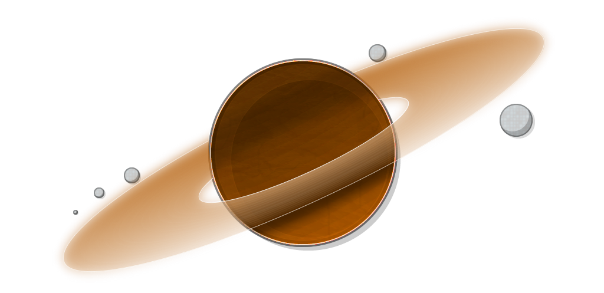

<h3 align="center">Saturn</h3>

    
    
    
    

    <!--- I wish the logo was smaller -->
    

    Saturn is primarily an early-stage game engine for Windows.
     
    Currently Saturn is built in Vulkan, in the furture we want to support other APIs.    

## Getting Started
Visual Studio 2022 is recommended, Saturn is officially untested on other development environments whilst we focus on a Windows build.

Start by cloning the repository with `git clone --recursive https://github.com/BEASTSM96/Saturn-Engine`.

If the repository was cloned non-recursively previously, use `git submodule update --init` to clone the necessary submodules.

## Buiding

In order to start building you will need <a href="https://premake.github.io/">Premake</a>

<a href="https://premake.github.io/download">Download</a>

<a href="https://premake.github.io/docs/What-Is-Premake">Learn More</a>

## Generating the project files (Windows)

To generate the project files, you can just run the premake executable that you downloaded, if you already have premake installed make sure it can support generating Visual Studio 2022 project files *so v5.0.0-beta1 onwards*.

So for generating the project files you should do : `premake5.exe vs2022`

## Compiling the engine

To compile the engine simply open the newly generated project files and build the solution.

## Features soon to come
PBR Renderer, equirectangular cubemaps, shadows and a material workflow.
 
PhysX.
 
C++/C# native scripting.
 
Linux support.
 
Project system.
 
Asset manager.
 
Game/Engine launcher.
<!--- UI REWORK -->
<!--- Vulkan 1.3 support -->
<!--- Controller support -->
<!--- Xbx support and/or PS4/5 support -->