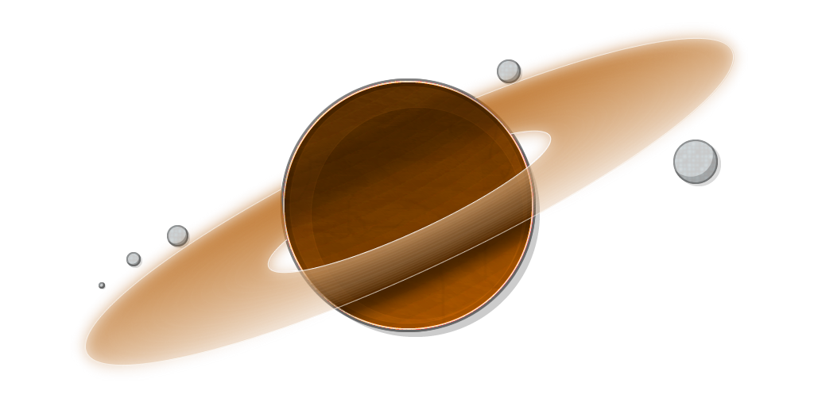

<h3 align="center">Saturn</h3>

    
    
    
    

    Saturn is primarily an early-stage 3D game engine for Windows.
     

## Platforms

| Platform | Supported | Architecture | Build Status |
| -------- | --------- | ------------ | ------------ |
| Windows 10+ | ✅ | x86_64 |     
| Linux | 🕗 *[SOON](https://trello.com/c/o43wueQO/9-preliminary-linux-support)* | x86_64 | No CI yet.
| macOS 15+ (Sequoia) | 🕗 | AArch64 | No CI yet.

## Features

- Renderer
  - PBR Rendering
  - SSAO
  - GTAO
  - SMAA
  - Bloom *[(done the proper way)](https://www.iryoku.com/next-generation-post-processing-in-call-of-duty-advanced-warfare/)*
  - Shadow Mapping
  - Forward+
  - Skeletal Animation
  - Font rendering, Screenspace/Worldspace
  - Normal Mapping
  - Instanced Rendering

- Editor
  - Node Editors for Materials, Sounds, Animation Graphs and Behaviour Trees.
  - Undo/Redo tracking
  - Asset Browser
  - World outliner panel
  - Many built-in Asset Viewers
  - Autosaves
  - Project Browser
  - Hot code reloading

- Engine
  - AI Pathfinding and Navmesh generation using [Recast](https://github.com/recastnavigation/recastnavigation/tree/main)
  - Behaviour Trees (Node Editor and Custom Tasks via C++)
  - C++ Scripting, using an Unreal-like `UClass` and `UObject` reflection system with a Custom Build Tool, with support for SProperties. 
  - Physics System via [JoltPhysics](https://github.com/jrouwe/JoltPhysics)
  - Distribution i.e. shipping the game as a standalone executable via our Asset Bundle system
  - Audio System via [MiniAudio](https://miniaud.io/)
  - Game UI system (called Alura)
  - Job system
  - ECS via [EnTT](https://github.com/skypjack/entt)
  - Keybindings
  - Online subsystem (Steamworks API)
  - Texture streaming

## Roadmap

For upcoming features and a general status of Saturn it is best to view the [Trello](https://trello.com/b/baqP3fvB/saturn-engine)

## Getting Started & Prerequisites

Before anything please make sure you have the [Vulkan SDK](https://vulkan.lunarg.com/sdk/home) installed.
If you do not have the Vulkan SDK the project will **not** build.
Saturn uses vulkan version 1.2, however any newer version should "just work". When installing if there's an option about debug binaries make sure to tick that.

Now, start by cloning the repository with `git clone --recursive https://github.com/0xsmft/Saturn-Engine`.

If the repository was previously cloned non-recursively then use `git submodule update --init` to clone the necessary submodules.

Make sure to check that you are on the branch `vulkan`. If not you can run `git checkout vulkan` 

## Generating project files

In order to start you will need to download <a href="https://premake.github.io/">Premake</a>

<a href="https://premake.github.io/download">Download</a> ·
<a href="https://premake.github.io/docs/What-Is-Premake">Learn More</a>

*You may want to add the premake executable to you PATH environment variable.*

On Windows, Visual Studio 2022 is recommended as Saturn is officially untested on other development environments.

So for generating the project files on Visual Studio 2022 you'd do `premake5.exe vs2022` or on Linux use `premake5 gmake2`.

## Compiling the engine (Windows)

To compile the engine simply open the newly generated project files and build the entire solution.

### Running the engine

Before launching the editor you must create a new project as this repo does not contain a default project.
So, set the project browser as the startup project and run (F5), create a new project and launch it from the browser. After that you can set the Editor (Saturn-Editor) as the startup project and it will automatically load the most recent project. Or a project file specified in the command line argument.

## License

This project is licensed under the MIT License, for more information check the [LICENSE](https://github.com/BEASTSM96/Saturn-Engine/blob/vulkan/LICENSE) file.
